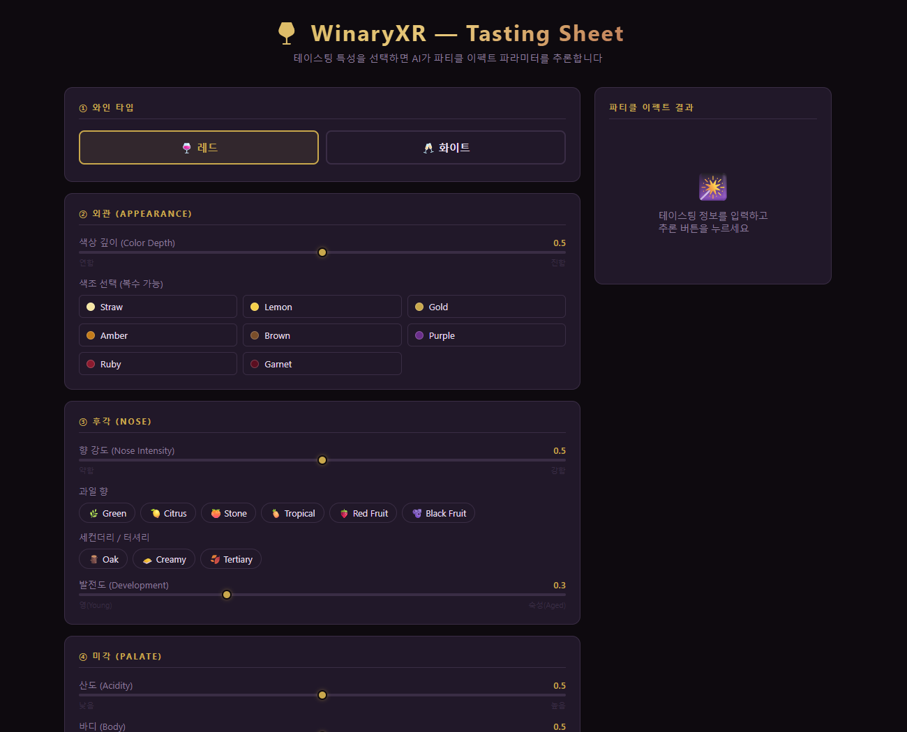
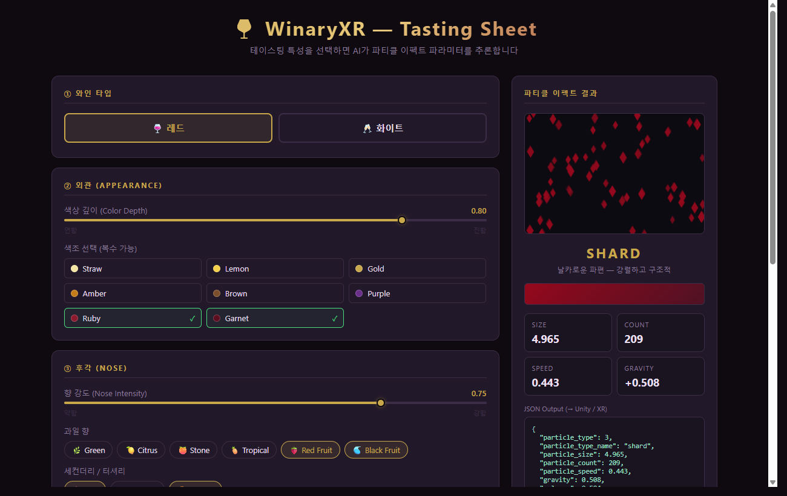

# WinaryXR — Wine Tasting → Particle Effect

와인 테이스팅 특성을 입력하면 AI(Random Forest)가 XR 파티클 이펙트 파라미터를 추론해주는 웹 앱입니다.
브라우저에서 테이스팅 시트를 체크하고 버튼을 누르면, Unity/XR에서 바로 사용할 수 있는 JSON 파라미터가 출력됩니다.
XR 환경에서 와인의 맛, 향, 색 등을 마시기 전에 직관적으로 파악할 수 있는 파티클 이펙트를 생성하기 위한 기초 개발입니다. 

---

## 웹 UI

### 입력 화면



왼쪽 패널에서 5가지 항목을 입력합니다.

| 섹션 | 입력 항목 |
|---|---|
| ① 와인 타입 | 레드 / 화이트 (라디오 버튼) |
| ② 외관 | 색상 깊이 슬라이더 + 색조 체크박스 (Straw, Lemon, Gold, Amber, Brown, Purple, Ruby, Garnet) |
| ③ 후각 | 향 강도 슬라이더 + 과일향 칩 (Green, Citrus, Stone, Tropical, Red Fruit, Black Fruit) + Oak / Creamy / Tertiary + 발전도 슬라이더 |
| ④ 미각 | 산도 / 바디 / 피니쉬 / 타닌 슬라이더 |
| ⑤ 종합 평가 | 복잡도 / 강도 슬라이더 |

### 출력 화면 — `✨ 파티클 파라미터 추론` 버튼 클릭 후



오른쪽 패널에 결과가 표시됩니다.

| 출력 | 설명 |
|---|---|
| 파티클 미리보기 | 추론된 파라미터로 실시간 캔버스 애니메이션 |
| 파티클 타입 | bubble / teardrop / smoke / shard / crystal |
| 색상 스와치 | 추론된 RGB 색상 미리보기 |
| Size / Count / Speed / Gravity | 수치 파라미터 요약 |
| JSON Output | Unity / XR에 바로 붙여넣을 수 있는 JSON |

### 출력 JSON 예시

레드 와인, 진한 루비-가넷 색, 블랙프룻·Oak·Tertiary, 풀바디·높은 타닌으로 입력하면:

```json
{
  "particle_type": 3,
  "particle_type_name": "shard",
  "particle_size": 4.965,
  "particle_count": 209,
  "particle_speed": 0.443,
  "gravity": 0.508,
  "color_r": 0.584,
  "color_g": 0.032,
  "color_b": 0.111
}
```

---

## 시작하기

### 1. conda 환경 만들기

```bash
conda create -n winaryxr python=3.11
conda activate winaryxr
```

### 2. 패키지 설치

```bash
pip install scikit-learn numpy pandas matplotlib seaborn flask joblib notebook
```

### 3. 모델 학습 및 저장

Jupyter Notebook을 열고 모든 셀을 실행합니다.

```bash
jupyter notebook wine_tasting_ml.ipynb
```

> 실행 완료 후 `models/` 폴더에 `.pkl` 파일 3개가 생성되어야 합니다.
> ```
> models/
>   rf_regressor.pkl
>   rf_classifier.pkl
>   scaler_count.pkl
> ```

### 4. Flask 서버 실행

```bash
python app.py
```

### 5. 브라우저에서 열기

```
http://localhost:5000
```

---

## 파티클 타입 설명

| 타입 | 이름 | 설명 |
|---|---|---|
| 0 | bubble | 둥글고 가벼운 기포 — 산도 높고 가벼운 와인 |
| 1 | teardrop | 눈물방울 — 부드럽고 흘러내리는 |
| 2 | smoke | 퍼지는 연기 — 복잡하고 깊은 |
| 3 | shard | 날카로운 파편 — 강렬하고 구조적 |
| 4 | crystal | 결정 구조 — 섬세하고 정교한 |

---

## 파일 구조

```
WinaryXR/
├── wine_tasting_dataset.csv   # 학습 데이터
├── wine_tasting_ml.ipynb      # 모델 학습 노트북
├── app.py                     # Flask 서버
├── templates/
│   └── index.html             # 테이스팅 UI
├── images/                    # README 스크린샷
│   ├── ui_input.png
│   └── ui_result.png
└── models/                    # 학습 후 자동 생성
    ├── rf_regressor.pkl
    ├── rf_classifier.pkl
    └── scaler_count.pkl
```
